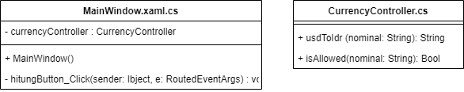

# Simple Currency App
Aplikasi ini adalah aplikasi untuk konversi mata uang USD ke IDR. Satu USD dianggap senilai dengan Rp. 15000

<br></br>
## Scope and Functionalities
* User dapat menginputkan angka
* User dapat meng-klik tombol hitung
* User mendapat feedback ketika inputan tidak valid berupa teks

<br></br>
## How Does it works?
Diawali dari method `MainWindow()` pada `class MainWindow.xaml.cs`, kita deklarasikan dan membuat instance
dari `CurrencyController`

```csharp
        public MainWindow()
        {
            InitializeComponent();
            currencyController = new CurrencyController();
        }
```

Pada method `hitungButton_Click()`, akan mengecek apakah inputnya valid atau tidak menggunakan `curencyController.isAllowed()`,
jika valid, maka input akan dikonversikan dari USD ke IDR menggunakan `currencyController.usdToIdr()` dan akan dimasukkan ke variable `result`.
Variable `result` akan dimasukkan kedalam label dengan `resultLabel.Content = result`

```csharp
        private void hitungButton_Click(object sender, RoutedEventArgs e)
        {
            var nominalString = inputTextBox.Text;

            var result = "Inputan tidak valid";

            if(currencyController.isAllowed(nominalString))
            {
                result = "Rp. " + currencyController.usdToIdr(nominalString);
            }

            resultLabel.Content = result;
            
        }
```


<br></br>
Logika untuk konversi dari USD ke IDR terdapat pada `CurrencyController.cs`, terdapat dua method/function, 
yaitu `usdToIdr()` dan `isAllowed()` 


Method `usdToIdr()` menerima parameter nominal berupa `string`, lalu dikonversikan ke `double` dengan `Convert.ToDouble()`.
Value dari parameter yang telah dikonversikan tadi, dikalikan dengan 15000 yang disimpan pada variable `result` lalu dikonversikan lagi
kedalam `string` dan dikembalikan lagi

```csharp
        public string usdToIdr (string nominal)
        {
            var nominalDouble = Convert.ToDouble(nominal);
            var result = nominalDouble * 15000;
            return Convert.ToString(result);
        }
```


Pada method `isAllowed()`, menerima parameter nominal berupa string juga. Lalu parameter tadi dievaluasi nilainya
menggunakan regular expression. Lalu method `isAllowed()` akan mengembalikan nilai boolean benar atau salah, yang didapat
dari `!regex.IsMatch(nominal)`

```csharp
        public Boolean isAllowed (string nominal)
        {
            Regex regex = new Regex("[^0-9.-]+");
            return !regex.IsMatch(nominal);
        }
```

<br></br>

## Latihan
##### 1. Mengapa perlu membuat class `CurrencyController.cs` pada percobaan 4? <br>
   Untuk memisahkan logic aplikasi dari main code, sehingga source code menjadi lebih bersih dan readable serta mudah dalam maintenance jika ingin dikembangkan lagi
##### 2. Jelaskan kegunaan method `isAllowed()` pada percobaan 4! <br>
   Digunakaan untuk memvalidasi dari inputan user, apakah valid atau tidak. Jika invalid, maka aplikasi memberikan feedback kalau inputan yang dimasukkan tidak valid
##### 3. Jelaskan secara singkat mengenai Regex pada percobaan 4! <br>
   Regex pada percobaan 4 digunakan untuk mengevaluasi nilai dari paramater dengan pola tertentu. Pola `[^0-9.0-]+` mengevaluasi apakah nilai 0-9, titik (.), dan minus (-)
   ada pada parameter atau tidak
##### 4. Buatlah class diagramnya pada percobaan 4! <br>
   